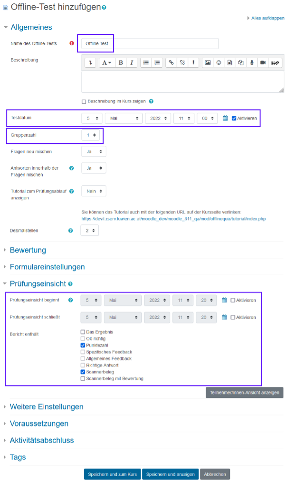

# Offline Tests durchführen

Dauer der Erstellung: ca. 25 min

Ziel und Lösungsweg:

- Test in Moodle zusammenstellen und danach im Hörsaal auf Papier durchführen lassen.
- Die Auswertung der Prüfungsbögen automatisiert in Moodle durchführen

## Anleitung

### Schritt 1

Wählen Sie „Bearbeiten einschalten” in der rechten oberen Ecke der Seite

Anschließend klicken Sie auf „Material oder Aktivität anlegen” im gewünschten Kursabschnitt.

### Schritt 2

Wählen Sie im Register „Aktivitäten” die Option „Offline-Test” aus.

#### Option 1

Lorem ipsum

#### Option 2

Lorem ipsum

### Schritt 3

Tragen Sie den „Namen des Offline-Tests” ein. Sie können ein Testdatum eingeben, wenn Sie zuvor die Checkbox „Aktivieren” anklicken. Legen Sie fest, wie viele Gruppen der Test haben soll. Bei Bedarf können Sie den Teilnehmer*innen eine Online-Prüfungseinsicht gewähren. Legen Sie den Zeitraum dafür fest und welche Aspekte die Teilnehmer*innen sehen dürfen. Sichern Sie Ihre Einstellungen mittels der Schaltfläche „Speichern und anzeigen”.

